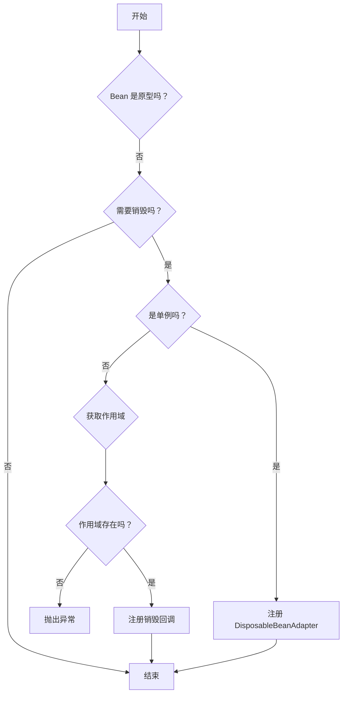

## 继承关系图
![[AbstractBeanFactory 继承关系.png]]
 
## 单例缓存功能
 抽象 Bean 工厂类通过继承了 `DefaultSingletonBeanRegistry` 类，获得了单例缓存的功能。
 但是并没有提供 Bean 注册的能力，`createBean` 方法在类中并没有被实现。

## 单例与原型 Bean
 提供了单例（Singleton） Bean 与原型（Prototype） Bean 的确认，具体体现在其 `doGetBean` 方法中：
 ```java
 protected <T> T doGetBean(  
       String name, @Nullable Class<T> requiredType, @Nullable Object[] args, boolean typeCheckOnly)  
       throws BeansException {  
  
    String beanName = transformedBeanName(name);  
    Object beanInstance;  
  
    // 检查手动注册的单例 Bean 缓存
    Object sharedInstance = getSingleton(beanName);  
    if (sharedInstance != null && args == null) {
	   // 如果产生了循环依赖，这个位置相当于一个出口，返回的是一个为初始化好的 Bean  
       beanInstance = getObjectForBeanInstance(sharedInstance, name, beanName, null);  
    }  
    else {  
       try {  
          if (requiredType != null) {  
             beanCreation.tag("beanType", requiredType::toString);  
          }  
          RootBeanDefinition mbd = getMergedLocalBeanDefinition(beanName);  
          checkMergedBeanDefinition(mbd, beanName, args);  
  
          // 确保当前 Bean 依赖的 Bean 的初始化，如果在这里还检查出了循环依赖，直接报错
          String[] dependsOn = mbd.getDependsOn();  
          if (dependsOn != null) {  
             for (String dep : dependsOn) {  
                if (isDependent(beanName, dep)) {  
                   throw new BeanCreationException(mbd.getResourceDescription(), beanName,  
                         "Circular depends-on relationship between '" + beanName + "' and '" + dep + "'");  
                }  
                registerDependentBean(dep, beanName);  
                try {  
                   getBean(dep);  
                }  
                catch (NoSuchBeanDefinitionException ex) {  
                   throw new BeanCreationException(mbd.getResourceDescription(), beanName,  
                         "'" + beanName + "' depends on missing bean '" + dep + "'", ex);  
                }  
             }  
          }  
  
          // Create bean instance.  
          if (mbd.isSingleton()) {  
            // 处理单例 Bean
          }  
          else if (mbd.isPrototype()) {  
             // 处理原型 Bean
          }  
          else {  
             // 处理其他 Scope 的 Bean
          }  
       }  
    }  
  
    return adaptBeanInstance(name, beanInstance, requiredType);  
}
```

## 对 Factory Bean 的支持
提供了对 `FactoryBean` 的一系列处理，`FactoryBean` 是 Spring 框架中的一个特殊接口，用于创建复杂或自定义实例。
首先提供了判断 Factory Bean 的能力：
```java
@Override  
public boolean isFactoryBean(String name) throws NoSuchBeanDefinitionException {  
    String beanName = transformedBeanName(name);  
    Object beanInstance = getSingleton(beanName, false);  
    if (beanInstance != null) {  
       return (beanInstance instanceof FactoryBean);  
    }  
    // No singleton instance found -> check bean definition.  
    if (!containsBeanDefinition(beanName) && getParentBeanFactory() instanceof ConfigurableBeanFactory) {  
       // No bean definition found in this factory -> delegate to parent.  
       return ((ConfigurableBeanFactory) getParentBeanFactory()).isFactoryBean(name);  
    }  
    return isFactoryBean(beanName, getMergedLocalBeanDefinition(beanName));  
}
```

`getType` 对 Factory Bean 的支持：
```java
public Class<?> getType(String name, boolean allowFactoryBeanInit) throws NoSuchBeanDefinitionException {  
	// 其他 Type
	
    // 判断 Factory Bean 
    if (beanClass != null && FactoryBean.class.isAssignableFrom(beanClass)) {  
       if (!BeanFactoryUtils.isFactoryDereference(name)) {  
          // If it's a FactoryBean, we want to look at what it creates, not at the factory class.  
          return getTypeForFactoryBean(beanName, mbd, allowFactoryBeanInit).resolve();  
       }  
       else {  
          return beanClass;  
       }  
    }  
    else {  
       return (!BeanFactoryUtils.isFactoryDereference(name) ? beanClass : null);  
    }  
}
```

确定 Factory Bean 定义 Bean 的类型：
```java
protected ResolvableType getTypeForFactoryBean(String beanName, RootBeanDefinition mbd, boolean allowInit) {  
    ResolvableType result = getTypeForFactoryBeanFromAttributes(mbd);  
    if (result != ResolvableType.NONE) {  
       return result;  
    }  
  
    if (allowInit && mbd.isSingleton()) {  
       try {  
          FactoryBean<?> factoryBean = doGetBean(FACTORY_BEAN_PREFIX + beanName, FactoryBean.class, null, true);  
          Class<?> objectType = getTypeForFactoryBean(factoryBean);  
          return (objectType != null ? ResolvableType.forClass(objectType) : ResolvableType.NONE);  
       }  
       catch (BeanCreationException ex) {  
			// 对 Bean 异常的处理
       }  
    }  
    return ResolvableType.NONE;  
}
```

## 别名管理
具体体现在 `getAliases(String name)` 方法：
```java
@Override  
public String[] getAliases(String name) {  
    String beanName = transformedBeanName(name);  
    List<String> aliases = new ArrayList<>();  
    boolean factoryPrefix = name.startsWith(FACTORY_BEAN_PREFIX);  
    String fullBeanName = beanName;  
    if (factoryPrefix) {  
       fullBeanName = FACTORY_BEAN_PREFIX + beanName;  
    }  
    if (!fullBeanName.equals(name)) {  
       aliases.add(fullBeanName);  
    }  
    String[] retrievedAliases = super.getAliases(beanName);  
    String prefix = factoryPrefix ? FACTORY_BEAN_PREFIX : "";  
    for (String retrievedAlias : retrievedAliases) {  
       String alias = prefix + retrievedAlias;  
       if (!alias.equals(name)) {  
          aliases.add(alias);  
       }  
    }  
    if (!containsSingleton(beanName) && !containsBeanDefinition(beanName)) {  
       BeanFactory parentBeanFactory = getParentBeanFactory();  
       if (parentBeanFactory != null) {  
          aliases.addAll(Arrays.asList(parentBeanFactory.getAliases(fullBeanName)));  
       }  
    }  
    return StringUtils.toStringArray(aliases);  
}
```
这段代码实现了 `getAliases` 方法，用于获取指定名称的 `bean` 的所有别名。具体步骤如下：
- 转换 bean 名称：调用 `transformedBeanName` 方法将输入的名称转换为标准的 bean 名称。
- 初始化别名列表：创建一个 `ArrayList` 用于存储别名。
- 处理工厂前缀：检查输入名称是否以 `FACTORY_BEAN_PREFIX` 开头，如果是，则在标准名称前加上该前缀。
- 添加完整名称：如果处理后的完整名称与输入名称不同，则将其添加到别名列表中。
- 获取父类别名：调用父类的 `getAliases` 方法获取标准名称的所有别名，并根据是否包含工厂前缀进行处理，将符合条件的别名添加到列表中。
- 检查单例和定义：如果当前 bean 工厂中没有该 bean 的单例实例或定义，则从父 bean 工厂中获取别名并添加到列表中。
- 返回结果：将别名列表转换为数组并返回。
## Bean 销毁
通过实现 `DisposableBean` 接口，Bean 对象可以知名当自己被销毁的时候需要执行什么操作。
在 AbstractBeanFactory 中定义了这样一个方法，可以销毁创建的原型 Bean。
```java
/**  
 * Destroy the given bean instance (usually a prototype instance 
 * obtained from this factory) according to the given bean definition.  
 * @param beanName the name of the bean definition  
 * @param bean the bean instance to destroy  
 * @param mbd the merged bean definition  
 */
protected void destroyBean(String beanName, Object bean, RootBeanDefinition mbd) {  
    new DisposableBeanAdapter(  
          bean, beanName, mbd, getBeanPostProcessorCache().destructionAware, getAccessControlContext()).destroy();  
}
```
具体就是创建了一个 `DisposableBeanAdapter` 然后调用其 `destroy()` 方法。

确定 Bean 是否需要销毁：
```java
/**  
 * Determine whether the given bean requires destruction on shutdown. 
 * <p>The default implementation checks the DisposableBean interface as well as  
 * a specified destroy method and registered DestructionAwareBeanPostProcessors. 
 * @param bean the bean instance to check  
 * @param mbd the corresponding bean definition  
 * @see org.springframework.beans.factory.DisposableBean  
 * @see AbstractBeanDefinition#getDestroyMethodName()  
 * @see org.springframework.beans.factory.config.DestructionAwareBeanPostProcessor  
 */  
protected boolean requiresDestruction(Object bean, RootBeanDefinition mbd) {  
    return (bean.getClass() != NullBean.class && (DisposableBeanAdapter.hasDestroyMethod(bean, mbd) ||  
          (hasDestructionAwareBeanPostProcessors() && DisposableBeanAdapter.hasApplicableProcessors(  
                bean, getBeanPostProcessorCache().destructionAware))));  
}
```
检查 bean 是否为 NullBean：
	如果 bean 的类是 NullBean，则不需要销毁，**直接返回 false。**
检查 bean 是否有销毁方法：
	使用 DisposableBeanAdapter.hasDestroyMethod(bean, mbd) 方法检查 bean 是否实现了 DisposableBean 接口或定义了销毁方法。
	**如果有销毁方法，返回 true。**
检查 DestructionAwareBeanPostProcessor：
	使用 hasDestructionAwareBeanPostProcessors() 方法检查是否有注册的 DestructionAwareBeanPostProcessor 处理器。
	**如果没有处理器，返回 false。**
检查处理器是否适用于 bean：
	使用 DisposableBeanAdapter.hasApplicableProcessors(bean, getBeanPostProcessorCache().destructionAware) 方法检查这些处理器是否适用于当前 bean。
	**如果适用，返回 true；否则返回 false。**

注册 Disposable Bean：
```java
protected void registerDisposableBeanIfNecessary(String beanName, Object bean, RootBeanDefinition mbd) {  
    AccessControlContext acc = (System.getSecurityManager() != null ? getAccessControlContext() : null);  
    if (!mbd.isPrototype() && requiresDestruction(bean, mbd)) {  
       if (mbd.isSingleton()) {  
          // Register a DisposableBean implementation that performs all destruction  
          // work for the given bean: DestructionAwareBeanPostProcessors,         
           // DisposableBean interface, custom destroy method.          
           registerDisposableBean(beanName, new DisposableBeanAdapter(  
                bean, beanName, mbd, getBeanPostProcessorCache().destructionAware, acc));  
       }  
       else {  
          // A bean with a custom scope...  
          Scope scope = this.scopes.get(mbd.getScope());  
          if (scope == null) {  
             throw new IllegalStateException("No Scope registered for scope name '" + mbd.getScope() + "'");  
          }  
          scope.registerDestructionCallback(beanName, new DisposableBeanAdapter(  
                bean, beanName, mbd, getBeanPostProcessorCache().destructionAware, acc));  
       }  
    }  
}
```
方法的执行流程是这样的：


