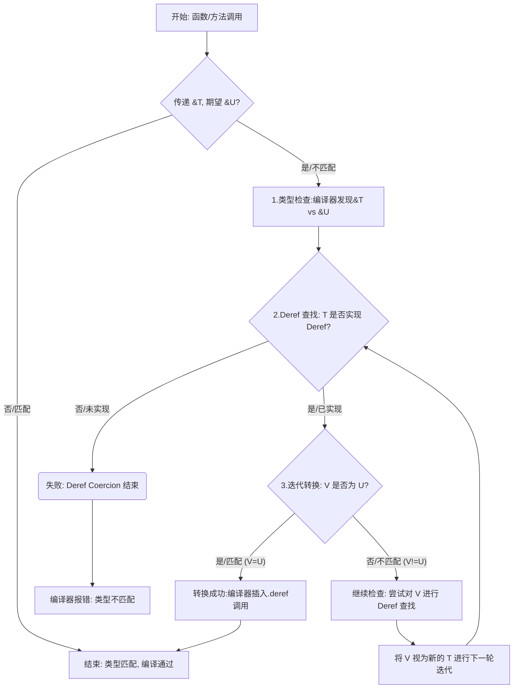

## 1	Why Deref Coercion

Rust 的 Ownership 是其安全性的基石, 它要求类型必须精确匹配, 例如, 一个函数的 syntax 是 `fn print(msg: &str)`, 那么理论上你只能传递一个 `&str` 类型的值. 此时, 假设你有这么两种类型的字符串: 

```rust
let s1 = String::from("hello");
let s2 = Box::new(String::from("workld"));
```

如果要调用 `print` 函数, 在没有 Deref Coercion 时, 你需要这样做:

```rust
print(&s1[..]);
print(&(*s2)[..]);
```

这样的代码繁琐且充满了认知负担, Deref Coercion 正是为了解决这个问题, 它的目标是: **在不牺牲任何安全性的前提下, 让编译器自动处理这些常见且安全的 Pointer 类型到其所指向内容的 Reference 的转化, 从而大大提升代码的便利性和可读性.**

实现 `Deref` Trait 允许我们自定义解引用操作符, 通过实现 `Deref` 灵巧指针也可以被当做普通指针来对待, 操作普通指针的代码便可以应用在灵巧指针上.

## 2	Operation Mechanism

### 2.1	Deref Trait

```rust
// std::ops::Deref
trait Deref {
    type Target; // 关联类型，指定解引用后得到什么类型
    fn deref(&self) -> &Self::Target; // 核心方法，返回一个指向 Target 的引用
}
```

`Deref` Trait 是整个机制的基石, 任何类型 `T` 如果实现了 `Deref<Target=U>` 就等于向编译器声明: 你可以把 `&T` 当做一个指向 `U` 的引用 `&U` 来看待; 例如, `String` 类型实现了 `Deref<Target=str>`, 这代表了 `&String` 可以转化为 `&str` 使用.

编译器内置了一套规则, 当函数或者方法发现入参中的**引用**类型不匹配时, 会自动尝试进行 Deref Coercion, 整个过程是**静默的**, **连续的**.

### 2.3	Execution Steps

Deref Coercion 触发的时机是: **当一个值的引用作为参数传递给函数或方法时, 如果其实际类型与期望类型不符, 编译器就会介入**.

具体的执行流程图如下:


例如, 对于 `&Box<String>` 传递给期望 `&str` 的函数: `&Box<String>` → `.deref()` → `&String` → `.deref()` → `&str`

```rust
fn main() {
    let box_str = Box::new(String::from("Ryan"));
    print(&box_str);
}

fn print(s: &str) {
    println!("{:?}", s);
}
```

## 3	Associated Functions

所有在 `impl` 块中定义的**函数**称为 associated functions;

对于执行不需要依赖实例的函数, 我们可以定义没有 `self` 的 Function, 我们可以用类型 `String::from` 的方式来调用这类函数.

Associated Functions 通常用于构造函数:

```rust
impl Rectangle {
    fn square(size: u32) -> Rectangle {
        Rectangle {
            width: size,
            height: size,
        }
    }
}
```